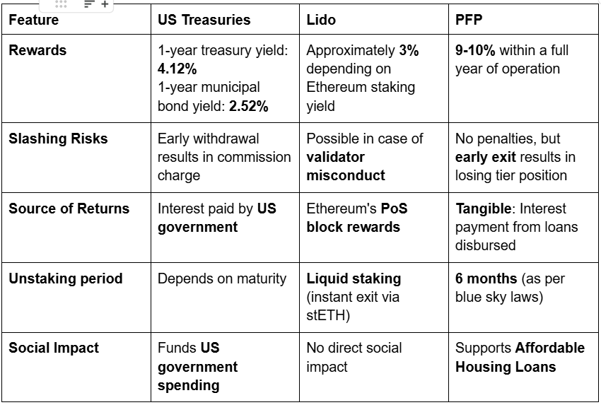
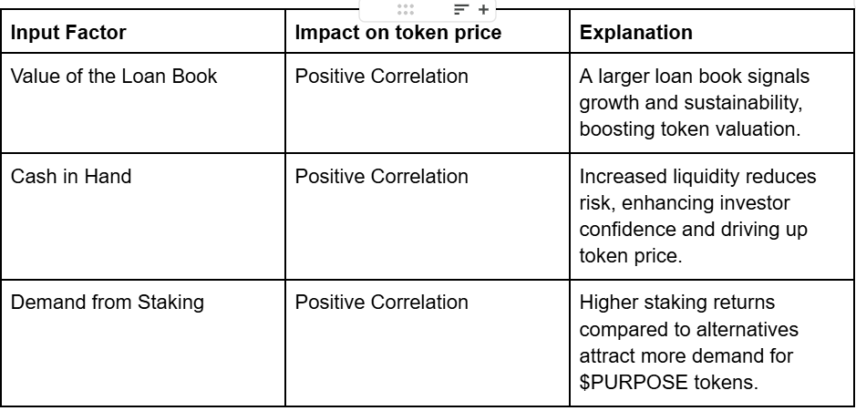
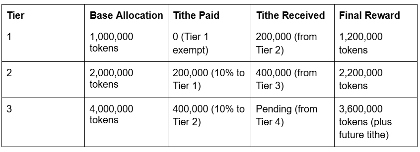
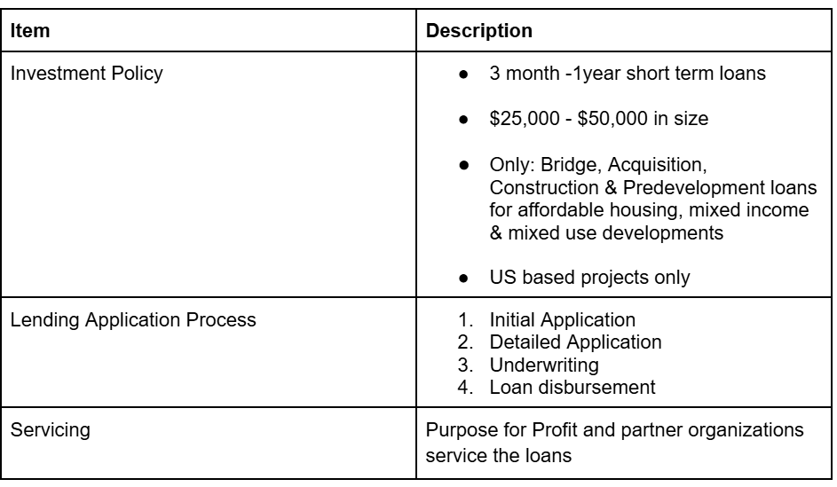

# Purpose For Profit Whitepaper

***Transforming Capital Into Impact***

## Table of Contents ###########################################

* [Executive Summary](#executive-summary)
    * [Abstract](#abstract)
    * [Vision](#vision)
    * [Mission](#mission)
* [The Housing Crisis](#the-housing-crisis)
    * [Problem Statement](#problem-statement)
    * [Market Opportunity](#market-opportunity)
    * [The Need for Innovative Financing](#the-need-for-innovative-financing)
* [Our Solution](#our-solution)
    * [Solution Overview](#solution-overview)
    * [Competitive Positioning](#competitive-positioning)
    * [Unique Value Proposition](#unique-value-proposition)
* [Product Framework](#product-framework)
    * [Business Model](#business-model)
    * [Key Features for Investors](#key-features-for-investors)
    * [Key Features for Borrowers](#key-features-for-borrowers)
* [Tokenomics](#tokenomics)
    * [$PURPOSE Token Overview](#purpose-token-overview)
    * [Token Utility & Distribution](#token-utility-&-distribution)
    * [Price Mechanisms](#price-mechanisms)
* [Staking & Rewards System](#staking-&-rewards-system)
    * [Staking Mechanism](#staking-mechanism)
    * [Tiered Reward Structure](#tiered-reward-structure)
    * [Rewards Distribution System](#rewards-distribution-system)
    * [Example Distribution Scenario](#example-distribution-scenario)
* [Loan Framework](#loan-framework)
    * [Loan Structuring & Compliance](#loan-structuring-&-compliance)
    * [Investment Policy](#investment-policy)
    * [Lending Application Process](#lending-application-process)
    * [The On-chain Endowment Fund](#the-on-chain-endowment-fund)
* [Technical Implementation](#technical-implementation)
    * [Smart Contract Overview](#smart-contract-overview)
    * [Technical Audit & Code Review](#technical-audit-&-code-review)
    * [Governance & Flexibility](#governance-&-flexibility)
* [Measuring Impact](#measuring-impact)
    * [Financial Metrics](#financial-metrics)
    * [Social Impact Metrics](#social-impact-metrics)
    * [Transparency & Reporting](#transparency-&-reporting)
* [Roadmap](#roadmap)
    * [2025 and Beyond](#2025-and-beyond)
    * [Growth Strategy](#growth-strategy)
* [Connect with Us](#connect-with-us)
    * [Community Engagement](#community-engagement)
    * [Contact Information](#contact-information)


## 1.Executive Summary


### Abstract

Purpose for Profit (PFP) is the world's first on-chain lending fund dedicated to businesses building affordable and workforce housing. By leveraging blockchain technology, we provide transparent, efficient financing solutions while generating sustainable returns for investors through our innovative staking model.

### Vision

Increase housing availability through on-chain lending while delivering sustainable returns.
Activate a new wave of web3 impact investors, bridging blockchain and social good.
Onboard real estate, construction, and non-profit sectors to embrace decentralization and transparency for long-term impact.

### Mission

To address the housing crisis through sustainable and long-term growth initiatives, providing accessible capital to businesses developing affordable and workforce housing while creating transparent investment opportunities.

## 2.The Housing Crisis

### Problem Statement

In the United States, there is a shortage of over seven million affordable housing units, a crisis that requires an estimated **$300 billion** in investment. Over **twelve million** people are spending **fifty percent** or more of their income on housing, which is correlated to negative health consequences and higher eviction rates.

Affordable housing refers to housing that costs no more than 30% of household income, ensuring people can meet other basic needs like food, healthcare, and education. This includes workforce housing for those earning between 60% - 120% of the Area Median Income (AMI) who support the local economy but earn above the threshold for housing support programs.

***A key challenge of building affordable housing is accessing capital.***

Since the 2008 financial crisis, small and medium-sized businesses (SMBs) have struggled to access affordable capital. Banks have increased capitalization requirements and lowered risk tolerance, preferring to lend to businesses with assets exceeding one billion dollars. This has pushed many SMBs toward more expensive private-sector lending options.

The development of affordable housing faces additional complexities:

**Return on Investment**: Real estate often takes seven to eight years before providing returns.
**Lower Margins**: Affordable units have reduced margins, making projects less appealing to investors.
**Complicated Capital Stack**: Many projects involve eight or more organizations within the capital stack, each with unique requirements.

### Market Opportunity

- The affordable housing gap requires over **$300 billion** in investment; **$500 billion+** if including those spending 50% of income on housing.
- The cryptocurrency market is valued at **$3 trillion** and rapidly growing.
- US retail investors spend **$1.5 billion** daily on stock trading, indicating potential for capital reallocation.
- Impact investing interest is rising, expected to reach **$35 trillion** in the US alone.

The World Economic Forum estimates that by 2030, the tokenized real-world assets (RWA) market could reach **$16.1 trillion**, about 10% of global GDP. With over **7 million** affordable housing units needed in the US alone, our solution represents a multi-billion dollar opportunity.

### Key Factors Driving Expansion within Tokenized RWA (Affordable Housing Loans)

- **Permanent Transparency**: All transactions are securely and permanently recorded on-chain using Ethereum-based blockchain technology.
- **Increased Liquidity**: Our crowdsourced funding approach provides more capital pools for loans and increases investor returns.
- **Improved Efficiency**: Smart contracts eliminate intermediaries, enabling transparent tracking of fund movements.
- **Social & Financial Impact**: Our model funds real estate projects aligned with environmental, social, and governance (ESG) values.
 
## 3.Our Solution

## Solution Overview

PFP is the first on-chain lending fund dedicated to housing. All financial activities and key decision-making are recorded on the Base blockchain. Stakers of the $PURPOSE token gain the right to share in 100% of revenue generated from loans. As PFP expands and decentralizes, token stakers will also have voting rights on interest rates, reward rates, project nominations, and expansion decisions.

The mint-as-you-purchase model ensures $PURPOSE tokens maintain a 1:1 correlation with capital raised. These tokens allow participants to benefit from the lending fund's performance and growth.

### Benefits of Our On-chain Framework

- **For Borrowers**: Easier access to credit at below private-market rates.
- **For Investors**: Opportunity to participate in socially impactful projects while earning competitive staking rewards.
- **For the Ecosystem**: Greater efficiency and reduced reliance on intermediaries, with enhanced transparency for tracking fund allocation.

### Competitive Positioning: Staking Rewards

PFP stands out among competitors through its unique combination of financial returns and social impact:



## 4.Product Framework

### Business Model


Our business model connects impact investors with affordable housing developers through a transparent blockchain infrastructure. By providing below-market-rate loans to qualified borrowers, we simultaneously generate returns for investors and address the housing shortage.

### Key Features for Investors

- **Financial Returns**: Competitive yields through staking $PURPOSE tokens, with rewards directly tied to project success.
- **Early Investor Staking Rewards**: Tier-based model rewards early investors with enhanced returns.
- **Sufficient Liquidity**: Our Initial Coin Offering and future DEX listings ensure easy entry and exit opportunities.
- **Exit without Penalty**: Investors can exit at any time without fees or slashing.
- **Transparency & Security**: Blockchain technology provides unparalleled transparency with all transactions recorded on-chain.

### Key Features for Borrowers

- **Affordable Funding**: Below private-market rate loans empower builders to develop affordable housing without high-interest financing burdens.
- **Streamlined Processes**: Smart contract automation accelerates loan approvals and disbursements, reducing delays and bureaucracy.
- **Long-Term Partnerships**: PFP establishes lasting partnerships and provides consistent support to build sustainable communities.
- **Positive Cycle of Giving**: Loan principal is re-lent to new borrowers, with 100% of interest flowing to the staking rewards pool.

## 5.Tokenomics

### $PURPOSE Token Overview

The $PURPOSE token is an unregistered security designed to facilitate the Purpose for Profit ecosystem, serving as a medium for staking and rewards distribution.

- Maximum supply: **4 billion** tokens
- Initial price: **$0.25** per token
- Tokens are minted upon purchase, ensuring circulating supply correlates with user demand

### Token Utility & Use Cases

- **Staking Rewards**: Users stake tokens to earn yield generated from loan interest, distributed proportionally based on staked amounts.
- **Loan Facilitation**: Tokens back an on-chain lending fund enabling below-market-rate loans to qualified borrowers.

### Distribution of Revenues

- 100% of loan revenue goes to the staking pool
- 15% of token sales fund operational costs for the Purpose for Profit foundation
- The foundation may stake its own reserve tokens depending on token sale results

### Price Mechanisms

As the ecosystem matures, token price will be influenced by three primary factors:



## 6.Staking & Rewards System

### Staking Mechanism

In our DeFi ecosystem, staking allows participants to lock up $PURPOSE tokens to contribute directly to our vision of supporting affordable housing. Key features include:

- **Tiered staking system** based on timestamp of deposit to the staking pool
- **Maximum limits** on tokens staked per tier
- **First-come-first-serve** model incentivizing early participation

### Tiered Reward Structure

Our time-stamped, tiered staking mechanism implements a progressive structure:

- Tier 1: 2,000,000 token ceiling
- Tier 2: 4,000,000 token ceiling
- Tier 3: 8,000,000 token ceiling
- Subsequent tiers follow this doubling pattern across 11 total tiers

### Rewards Distribution System

The Purpose for Profit platform implements a tiered reward distribution system where interest from loans is systematically distributed to users through a tithe-based mechanism:

#### Basic Principles

- Revenues are distributed across active tiers
- The tithe mechanism ensures fair distribution with higher returns for earlier stakers
- Each tier (except Tier 1) pays a 10% tithe to the preceding tier
- Smart contracts can be adjusted through community governance

#### Key Features

- **Tithe Cascade Effect**: Creates reward multiplier for earlier tiers
- **Dynamic Reward Rates**: Per-token rates increase for earlier tiers
- **Automatic Balance**: System self-adjusts based on active participation

### Example Distribution Scenario

#### Initial Conditions:

- **Total Rewards Distributed**: 10,000,000 Tokens
- **Total Staked**: 20,000,000
- **Base Token Rate**: 0.50 (Distribution/Total Stakers)

#### Distribution Breakdown:



## 7.Loan Framework

### Loan Structuring & Compliance

**The Purpose For Profit Lending Framework** outlines guidelines for providing short-term financing to businesses developing affordable and mixed-income housing in the United States. Our lending products include lines of credit, construction bridge loans, and short-term multi-family loans.



### The On-chain Endowment Fund

An endowment fund is an investment portfolio with initial capital from donations. In PFP's case, donations are tax-deductible and instrumental in providing below-market-rate loans for affordable housing. All profits generated are reinvested into the endowment, creating a perpetual capital pool for future projects.

#### The Unidirectional Nature of the Endowment Fund:

Funds allocated to the endowment cannot be withdrawn for operational expenses
The endowment's sole function is to grow and provide sustainable capital exclusively for affordable housing loans

#### Why This Matters:

- Unlike traditional lending models, PFP's endowment guarantees perpetual reinvestment into affordable housing
- Removing profit-taking incentives ensures the fund remains mission-driven
- On-chain implementation enhances accountability and verification of fund usage
- Smart contract automation removes inefficiencies in fund management

## 8.Technical Implementation

### Smart Contract Overview

Our reward distribution is handled by the distributeRewards function in the smart contract, which:

1. Calculates base allocations for each tier
2. Processes tithe payments between tiers
3. Updates reward rates per token
4. Distributes final rewards to stakers

```solidity
/**
    * @dev Distributes rewards to all tiers based on their respective staked amounts.
    * The rewards are distributed in a tithe system where each tier gives a percentage of its reward
    * to the tier above it.
    * @param amount The total amount of rewards to distribute.
    */
   function distributeRewards(uint256 amount) external onlyOwner nonReentrant {
       require(amount > 0, "Zero amount");


       // Cache the current index to save gas on multiple reads
       uint256 currentIndex = currentTierIndex;


       // Only allocate memory for active tiers
       TierData[] memory tierData = new TierData[](currentIndex + 1);
       uint256 totalStaked = 0;


       // First pass: Collect staking data and calculate initial rewards
       for (uint256 i = 0; i <= currentIndex; i++) {
           uint256 currentStake = tiers[i].currentStaked;
           if (currentStake > 0) {
               tierData[i].staked = currentStake;
               totalStaked += currentStake;
           }
       }


       require(totalStaked > 0, "No stakes");


       // Second pass: Calculate rewards and tithe in a single loop
       for (uint256 i = 0; i <= currentIndex; i++) {
           if (tierData[i].staked > 0) {
               // Calculate initial rewards
               tierData[i].rewards = (amount * tierData[i].staked) / totalStaked;


               // Apply tithe from current tier to previous tier
               if (i > 0 && tierData[i - 1].staked > 0) {
                   uint256 tithe = (tierData[i].rewards * TITHE_PERCENTAGE) / PERCENTAGE_BASE;
                   tierData[i].rewards -= tithe;
                   tierData[i - 1].rewards += tithe;
               }
           }
       }


       // Final pass: Update reward rates and prepare event data
       uint256[] memory newRates = new uint256[](currentIndex + 1);


       for (uint256 i = 0; i <= currentIndex; i++) {
           if (tierData[i].staked > 0) {
               uint256 newRewardRate = (tierData[i].rewards * PRECISION) / tierData[i].staked;
               tiers[i].accRewardPerShare += newRewardRate;
               newRates[i] = newRewardRate;
           }
       }


       require(token.transferFrom(msg.sender, address(this), amount), "Transfer failed");
       emit RewardsDistributed(amount, newRates);}
```

### Technical Audit & Code Review

For technical details, implementation specifics, and audit information, refer to:

- Audit report from Chainsafe
- GitHub repository: https://github.com/Purpose-for-Profit

### Governance & Flexibility

As a first-of-its-kind on-chain lending fund, our platform embraces transparency, smart contract automation, and community governance. As PFP grows, our governance framework will evolve to be fully participatory, with decisions driven by collective input from our community.

Key governance features include:

- Stakeholder voting on proposed changes and financial strategies
- Transparent record of all loan disbursements and token allocations
- Regular communication and updates on projects and performance metrics
 
## 9.Measuring Impact

### Financial Metrics

#### 1.Capital Raised:

- Initial target of $2-10 million for the first phase
- Future raises scaled to demand and investor confidence

#### 2.Loan Deployment & Capital Efficiency:

- Long-term goal of 100 loans annually
- Loan terms structured between 3-6 months with extensions up to 2 years

#### 3.Investor Returns & Staker Payouts:

- Transparent distributions based on project success
- Capital recirculation for sustained yield

### Social Impact Metrics

#### 1.Affordable Housing Development:

- Target of 2,000 new or rehabilitated units by 2028
- Alignment with community needs and affordability standards

#### 2.Job Creation & Economic Growth:

- Support for contractors and construction firms
- Promotion of local employment through funded projects

#### 3.Sustainability & Community Impact:

- Responsible lending and sustainable building practices
- Partnerships with organizations focused on long-term solutions

## 10.Roadmap


#### 2025 and Beyond

Our strategic roadmap outlines key milestones for growth and impact, including:

- Platform expansion
- Community governance implementation
- Scaling loan operations
- Developing additional impact metrics
- International expansion opportunities

## 11.Connect with Us

Join our community and follow our progress:

- [LinkedIn](https://www.linkedin.com/company/purpose-for-profit/posts/?feedView=all)
- [Discord](https://discord.com/invite/962xA85PYs)
- [Linktree](https://linktr.ee/PurposeforProfit?lt_utm_source=lt_share_link#419685699)
- [Github](https://github.com/purpose-for-profit)
- [X](https://x.com/Purpose4Profit)
- [Facebook](https://www.facebook.com/profile.php?id=61561249551343)
- [Telegram](https://t.me/PurposeforProfitChat)
- [PFP Staking UI](https://getpfp.org/buy)
